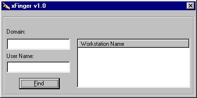



## Domain User Locator

### Description

The code may be useful for NT/W2K Administrators, or Help Desk personal. It will allow locate the workstation, user logged on to. Home server in user account properties (Connect... To..) must be specified, for the program to work. Once user logged on to domain, chances are good, that at list one resource is accessed on the home server. By enumerating sessions on the home server code retrieves workstation name the user logged on from.
 
### More Info
 

             |
---                |---
**Submitted On**   |2001-12-22 19:20:12
**By**             |[Gurgen Alaverdian](https://github.com/Planet-Source-Code/PSCIndex/blob/master/ByAuthor/gurgen-alaverdian.md)
**Level**          |Intermediate
**User Rating**    |4.8 (19 globes from 4 users)
**Compatibility**  |VB 6\.0
**Category**       |[Complete Applications](https://github.com/Planet-Source-Code/PSCIndex/blob/master/ByCategory/complete-applications__1-27.md)
**World**          |[Visual Basic](https://github.com/Planet-Source-Code/PSCIndex/blob/master/ByWorld/visual-basic.md)
**Archive File**   |[Domain\_Use4362712222001\.zip](https://github.com/Planet-Source-Code/gurgen-alaverdian-domain-user-locator__1-30047/archive/master.zip)

